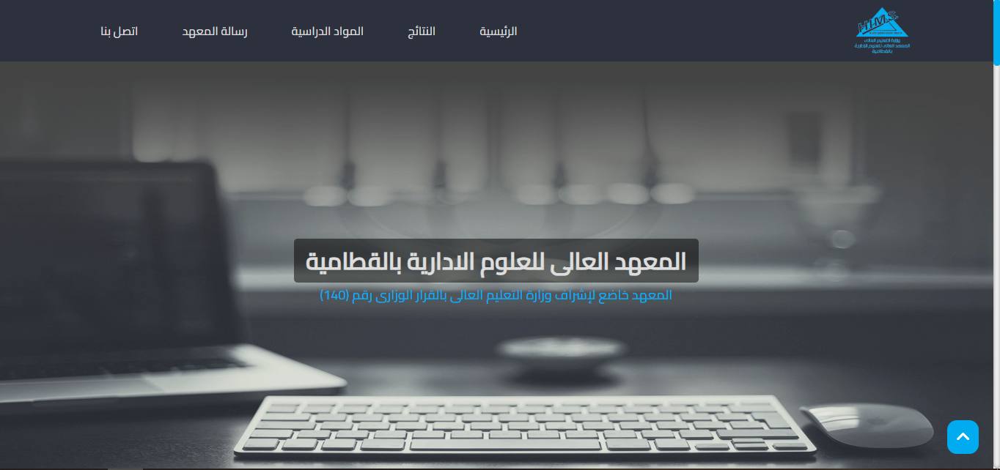

# HIMS Institute Website

This project showcases a static web page designed for the HIMS Institute, providing comprehensive information about the institute and linking it with a page displaying student results. This project marks the inception of my freelancing career.

## Project Overview

The website serves as a landing page for the HIMS Institute, offering visitors detailed information about the institute's programs, facilities, and contact information. Additionally, it includes a link to a separate page that presents the results of students.

## Technologies Used

- HTML
- CSS
- JavaScript
- jQuery
- AOS JavaScript library

## Project Link

Explore the project [here](https://toxn-boybot.github.io/HIMS/).

## About Me

I am a web developer passionate about creating engaging and functional websites. This project is a testament to my dedication and skills in the field.

---

Feel free to reach out for collaboration or further inquiries.
